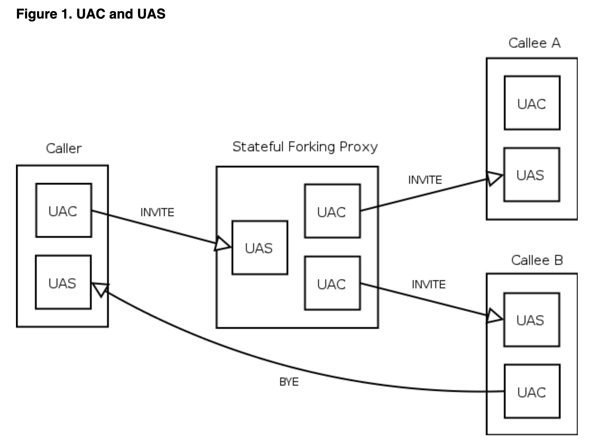

# Introduction au SIP

## Objectif du SIP

SIP signifie Session Initiation Protocol (protocole d'ouverture de session). Il s'agit d'un protocole de contrôle de la couche application qui a été développé et conçu au sein de l'IETF. Le protocole a été conçu dans l'optique d'une mise en œuvre facile, d'une bonne évolutivité et d'une grande souplesse.

La spécification est disponible sous la forme de plusieurs RFC, le plus important étant le RFC3261 qui contient la spécification du protocole de base. Le protocole est utilisé pour créer, modifier et terminer des sessions avec un ou plusieurs participants. Par sessions, nous entendons un ensemble d'expéditeurs et de récepteurs qui communiquent et l'état conservé dans ces expéditeurs et récepteurs pendant la communication. Les exemples de sessions peuvent comprendre les appels téléphoniques par Internet, la distribution de multimédia, les conférences multimédia, les jeux informatiques distribués, etc.

Le protocole SIP n'est pas le seul dont les dispositifs de communication auront besoin. Il n'est pas destiné à être un protocole à usage général. Le but du SIP est simplement de rendre la communication possible, la communication elle-même doit être réalisée par un autre moyen (et éventuellement un autre protocole). Les deux protocoles les plus souvent utilisés avec le SIP sont RTP et SDP. Le protocole RTP est utilisé pour transporter les données multimédia en temps réel (y compris l'audio, la vidéo et le texte), le protocole permet de coder et de diviser les données en paquets et de transporter ces paquets sur Internet. Un autre protocole important est le SDP, qui est utilisé pour décrire et encoder les capacités des participants à la session. Cette description est ensuite utilisée pour négocier les caractéristiques de la session afin que tous les appareils puissent participer (cela inclut, par exemple, la négociation des codecs utilisés pour encoder le support afin que tous les participants puissent le décoder, la négociation du protocole de transport utilisé, etc.)

Le SIP a été conçu en conformité avec le modèle Internet. Il s'agit d'un protocole de signalisation orienté de bout en bout, ce qui signifie que toute la logique est stockée dans les dispositifs finaux (à l'exception du routage des messages SIP). L'état est également stocké uniquement dans les dispositifs finaux, il n'y a pas de point de défaillance unique et les réseaux conçus de cette manière sont bien dimensionnés. Le prix que nous devons payer pour la distribution et l'extensibilité est une surcharge de messages plus élevée, causée par l'envoi des messages de bout en bout.

Il convient de mentionner que le concept de SIP de bout en bout est très différent du RTPC (réseau téléphonique public commuté) ordinaire, où tout l'état et la logique sont stockés dans le réseau et où les appareils terminaux (téléphones) sont très primitifs. L'objectif du SIP est de fournir les mêmes fonctionnalités que celles des RTPC traditionnels, mais la conception de bout en bout rend les réseaux SIP beaucoup plus puissants et ouverts à la mise en œuvre de nouveaux services qui peuvent difficilement être mis en œuvre dans les RTPC traditionnels.

Le SIP est basé sur le protocole HTTP. Le protocole HTTP a hérité du format des en-têtes de message de la RFC822. HTTP est probablement le protocole le plus réussi et le plus largement utilisé sur Internet. Il tente de combiner le meilleur des deux. En fait, le HTTP peut également être classé comme un protocole de signalisation, car les agents utilisateurs utilisent le protocole pour indiquer à un serveur HTTP les documents qui les intéressent. SIP est utilisé pour transporter la description des paramètres de session, la description est encodée dans un document en utilisant SDP. Les deux protocoles (HTTP et SIP) ont hérité du codage des en-têtes de message de la RFC822. L'encodage s'est avéré robuste et flexible au fil des ans.

##  SIP URI

Les entités SIP sont identifiées à l'aide du SIP URI (Uniform Resource Identifier). Un SIP URI se présente sous la forme *sip:username@domain*, par exemple, *sip:joe@company.com*. Comme on peut le voir, le SIP URI est constitué d'une partie nom d'utilisateur et d'une partie nom de domaine délimitées par le caractère @ (at). Les SIP URI sont similaires aux adresses électroniques, il est par exemple possible d'utiliser le même URI pour le courrier électronique et la communication SIP, ces URI sont faciles à mémoriser.

## Les éléments du réseau SIP

  Bien que dans la configuration la plus simple, il soit possible d'utiliser seulement deux agents utilisateurs qui s'envoient directement des messages SIP, un réseau SIP typique contiendra plus d'un type d'éléments SIP. Les éléments SIP de base sont les agents utilisateurs, les proxies, les bureaux d'enregistrement et les serveurs de redirection. Nous les décrirons brièvement dans cette section.

Notez que les éléments, tels qu'ils sont présentés dans cette section, ne sont souvent que des entités logiques. Il est souvent avantageux de les regrouper, par exemple pour augmenter la vitesse de traitement, mais cela dépend d'une mise en œuvre et d'une configuration particulières.

#### * Les agents utilisateurs (User Agents)

Les terminaux Internet qui utilisent le SIP pour se retrouver et pour négocier les caractéristiques d'une session sont appelés agents utilisateurs. Les agents utilisateurs résident généralement, mais pas nécessairement, sur l'ordinateur d'un utilisateur sous la forme d'une application - c'est actuellement l'approche la plus utilisée, mais les agents utilisateurs peuvent également être des téléphones portables, des passerelles RTPC, des PDA, des systèmes IVR automatisés, etc.

Les agents utilisateurs sont souvent appelés **User Agent Server (UAS)** et **User Agent Client (UAC)**. Les **UAS** et **UAC** sont des **entités logiques uniquement**, chaque agent utilisateur contient un UAC et un UAS. **L'UAC est la partie de l'agent utilisateur qui envoie les demandes et reçoit les réponses. L'UAS est la partie de l'agent utilisateur qui reçoit les demandes et envoie les réponses**.

Comme un agent utilisateur contient à la fois un UAC et un UAS, nous disons souvent qu'un agent utilisateur se comporte comme un UAC ou un UAS. Par exemple, l'agent utilisateur de l'appelant se comporte comme un UAC lorsqu'il envoie une demande INVITE et reçoit des réponses à cette demande. L'agent utilisateur de l'appelant se comporte comme un UAS lorsqu'il reçoit l'INVITE et envoie des réponses.

Mais cette situation change lorsque l'appelé décide d'envoyer un BYE et de mettre fin à la session. Dans ce cas, l'agent utilisateur de l'appelé (envoi d'un BYE) se comporte comme un UAC et l'agent utilisateur de l'appelant se comporte comme un UAS.

