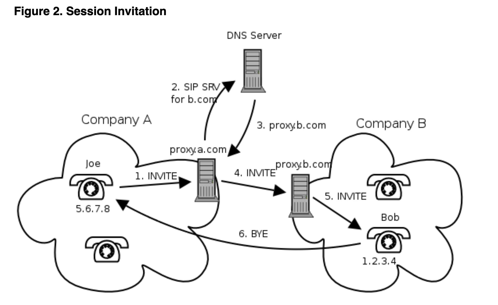
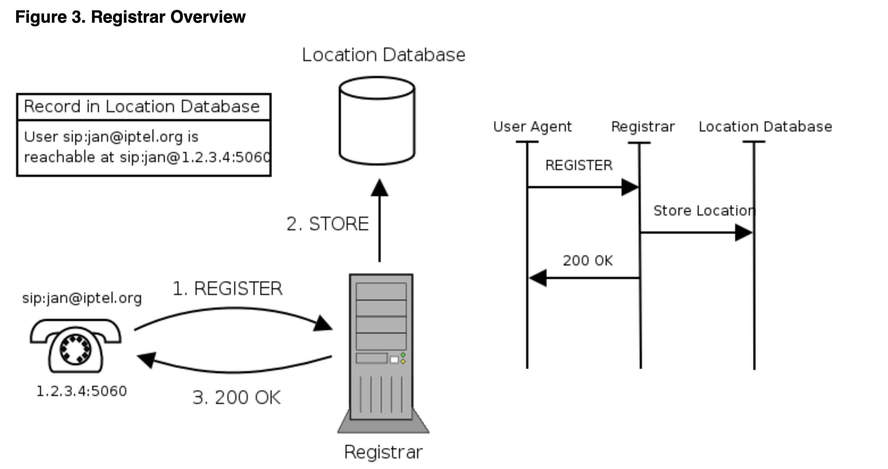
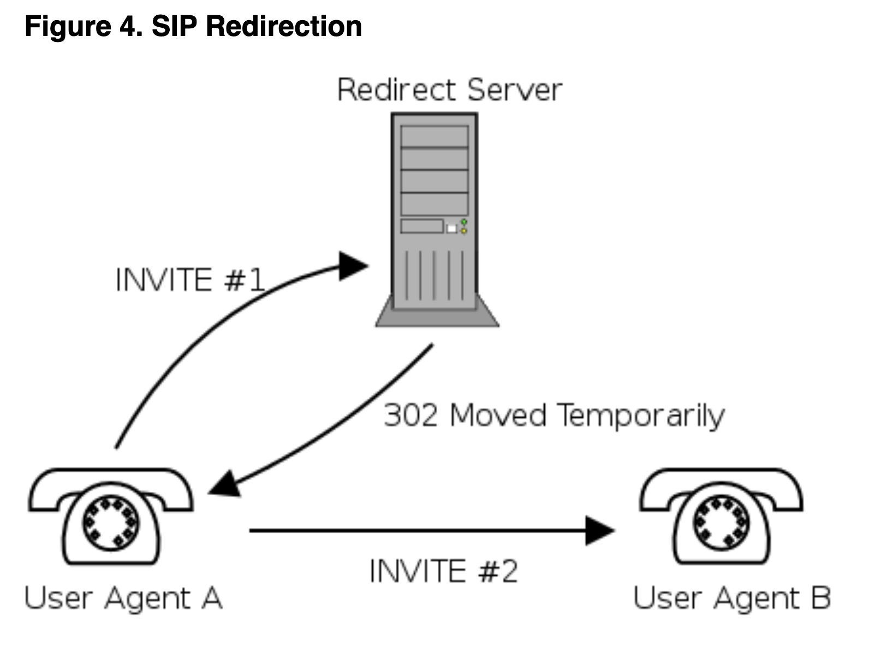

# Introduction au SIP

## Objectif du SIP

SIP signifie Session Initiation Protocol (protocole d'ouverture de session). Il s'agit d'un protocole de contrôle de la couche application qui a été développé et conçu au sein de l'IETF. Le protocole a été conçu dans l'optique d'une mise en œuvre facile, d'une bonne évolutivité et d'une grande souplesse.

La spécification est disponible sous la forme de plusieurs RFC, le plus important étant le RFC3261 qui contient la spécification du protocole de base. Le protocole est utilisé pour créer, modifier et terminer des sessions avec un ou plusieurs participants. Par sessions, nous entendons un ensemble d'expéditeurs et de récepteurs qui communiquent et l'état conservé dans ces expéditeurs et récepteurs pendant la communication. Les exemples de sessions peuvent comprendre les appels téléphoniques par Internet, la distribution de multimédia, les conférences multimédia, les jeux informatiques distribués, etc.

Le protocole SIP n'est pas le seul dont les dispositifs de communication auront besoin. Il n'est pas destiné à être un protocole à usage général. Le but du SIP est simplement de rendre la communication possible, la communication elle-même doit être réalisée par un autre moyen (et éventuellement un autre protocole). Les deux protocoles les plus souvent utilisés avec le SIP sont RTP et SDP. Le protocole RTP est utilisé pour transporter les données multimédia en temps réel (y compris l'audio, la vidéo et le texte), le protocole permet de coder et de diviser les données en paquets et de transporter ces paquets sur Internet. Un autre protocole important est le SDP, qui est utilisé pour décrire et encoder les capacités des participants à la session. Cette description est ensuite utilisée pour négocier les caractéristiques de la session afin que tous les appareils puissent participer (cela inclut, par exemple, la négociation des codecs utilisés pour encoder le support afin que tous les participants puissent le décoder, la négociation du protocole de transport utilisé, etc.)

Le SIP a été conçu en conformité avec le modèle Internet. Il s'agit d'un protocole de signalisation orienté de bout en bout, ce qui signifie que toute la logique est stockée dans les dispositifs finaux (à l'exception du routage des messages SIP). L'état est également stocké uniquement dans les dispositifs finaux, il n'y a pas de point de défaillance unique et les réseaux conçus de cette manière sont bien dimensionnés. Le prix que nous devons payer pour la distribution et l'extensibilité est une surcharge de messages plus élevée, causée par l'envoi des messages de bout en bout.

Il convient de mentionner que le concept de SIP de bout en bout est très différent du RTPC (réseau téléphonique public commuté) ordinaire, où tout l'état et la logique sont stockés dans le réseau et où les appareils terminaux (téléphones) sont très primitifs. L'objectif du SIP est de fournir les mêmes fonctionnalités que celles des RTPC traditionnels, mais la conception de bout en bout rend les réseaux SIP beaucoup plus puissants et ouverts à la mise en œuvre de nouveaux services qui peuvent difficilement être mis en œuvre dans les RTPC traditionnels.

Le SIP est basé sur le protocole HTTP. Le protocole HTTP a hérité du format des en-têtes de message de la RFC822. HTTP est probablement le protocole le plus réussi et le plus largement utilisé sur Internet. Il tente de combiner le meilleur des deux. En fait, le HTTP peut également être classé comme un protocole de signalisation, car les agents utilisateurs utilisent le protocole pour indiquer à un serveur HTTP les documents qui les intéressent. SIP est utilisé pour transporter la description des paramètres de session, la description est encodée dans un document en utilisant SDP. Les deux protocoles (HTTP et SIP) ont hérité du codage des en-têtes de message de la RFC822. L'encodage s'est avéré robuste et flexible au fil des ans.

##  SIP URI

Les entités SIP sont identifiées à l'aide du SIP URI (Uniform Resource Identifier). Un SIP URI se présente sous la forme *sip:username@domain*, par exemple, *sip:joe@company.com*. Comme on peut le voir, le SIP URI est constitué d'une partie nom d'utilisateur et d'une partie nom de domaine délimitées par le caractère @ (at). Les SIP URI sont similaires aux adresses électroniques, il est par exemple possible d'utiliser le même URI pour le courrier électronique et la communication SIP, ces URI sont faciles à mémoriser.

## Les éléments du réseau SIP

  Bien que dans la configuration la plus simple, il soit possible d'utiliser seulement deux agents utilisateurs qui s'envoient directement des messages SIP, un réseau SIP typique contiendra plus d'un type d'éléments SIP. Les éléments SIP de base sont les agents utilisateurs, les proxies, les bureaux d'enregistrement et les serveurs de redirection. Nous les décrirons brièvement dans cette section.

Notez que les éléments, tels qu'ils sont présentés dans cette section, ne sont souvent que des entités logiques. Il est souvent avantageux de les regrouper, par exemple pour augmenter la vitesse de traitement, mais cela dépend d'une mise en œuvre et d'une configuration particulières.

#### * Les agents utilisateurs (User Agents)

Les terminaux Internet qui utilisent le SIP pour se retrouver et pour négocier les caractéristiques d'une session sont appelés agents utilisateurs. Les agents utilisateurs résident généralement, mais pas nécessairement, sur l'ordinateur d'un utilisateur sous la forme d'une application - c'est actuellement l'approche la plus utilisée, mais les agents utilisateurs peuvent également être des téléphones portables, des passerelles RTPC, des PDA, des systèmes IVR automatisés, etc.

Les agents utilisateurs sont souvent appelés **User Agent Server (UAS)** et **User Agent Client (UAC)**. Les **UAS** et **UAC** sont des **entités logiques uniquement**, chaque agent utilisateur contient un UAC et un UAS. **L'UAC est la partie de l'agent utilisateur qui envoie les demandes et reçoit les réponses. L'UAS est la partie de l'agent utilisateur qui reçoit les demandes et envoie les réponses**.

Comme un agent utilisateur contient à la fois un UAC et un UAS, nous disons souvent qu'un agent utilisateur se comporte comme un UAC ou un UAS. Par exemple, l'agent utilisateur de l'appelant se comporte comme un UAC lorsqu'il envoie une demande INVITE et reçoit des réponses à cette demande. L'agent utilisateur de l'appelant se comporte comme un UAS lorsqu'il reçoit l'INVITE et envoie des réponses.

Mais cette situation change lorsque l'appelé décide d'envoyer un BYE et de mettre fin à la session. Dans ce cas, l'agent utilisateur de l'appelé (envoi d'un BYE) se comporte comme un UAC et l'agent utilisateur de l'appelant se comporte comme un UAS.

La figure 1, "UAC et UAS", montre trois agents utilisateurs et un proxy à bifurcation d'état (**stateful forking**). Chaque agent utilisateur contient UAC et UAS. La partie du proxy qui reçoit l'INVITE de l'appelant agit en fait comme un UAS. Lorsqu'il transmet la demande en mode "stateful forking", le proxy crée deux UAC, chacun d'eux étant responsable d'une branche.

Dans notre exemple, l'appelé B a décroché et plus tard, lorsqu'il veut démolir l'appel, il envoie un BYE. À ce moment, l'agent utilisateur qui était auparavant un UAS devient un UAC et vice versa.

#### * Serveurs mandataires (Proxy Servers)

En outre, le SIP permet la création d'une infrastructure d'hôtes de réseau appelée serveurs proxy. Les agents utilisateurs peuvent envoyer des messages à un serveur proxy. Les serveurs proxy sont des entités très importantes dans l'infrastructure SIP. **Ils assurent le routage des invitations à une session en fonction de l'emplacement actuel de l'invité, l'authentification, la comptabilité et de nombreuses autres fonctions importantes**.

La tâche la plus importante d'un serveur proxy est d'acheminer les invitations de session "plus près" de l'invité. L'invitation de session traverse généralement un ensemble de serveurs mandataires jusqu'à ce qu'elle trouve celui qui connaît l'emplacement réel de l'invité. Un tel proxy transmettra l'invitation de session directement à l'appelé et ce dernier acceptera ou refusera l'invitation de session.

Il existe deux types de base de serveurs proxy SIP : **stateless** (sans etat) et **stateful** (avec etat).

##### - Serveurs sans Etat (Stateless Servers)

Les serveurs sans Etat sont de simples transmetteurs de messages. Ils font suivre les messages indépendamment les uns des autres. Bien que les messages soient généralement organisés en transactions (voir la section 1.5, "Transactions SIP"), les serveurs mandataires sans état ne s'occupent pas des transactions.

Les serveurs mandataires sans état sont simples, mais plus rapides que les serveurs mandataires avec état. Ils peuvent être utilisés comme de simples équilibreurs de charge, traducteurs de messages et routeurs. L'un des inconvénients des serveurs mandataires sans état est qu'ils sont incapables d'absorber les retransmissions de messages et d'effectuer un routage plus avancé, par exemple, la dérivation (forking) ou la traversée récursive.

##### - Serveurs avec Etat (Statefull Servers)

Les procurations officielles sont plus complexes. À la réception d'une demande, les mandataires habilités à agir par procuration créent un état et le conservent jusqu'à la fin de la transaction. Certaines transactions, en particulier celles créées par INVITE, peuvent durer assez longtemps (jusqu'à ce que l'appelé décroche ou décline l'appel). Étant donné que les mandataires habilités doivent maintenir l'état pendant toute la durée des transactions, leur performance est limitée.

La possibilité d'associer des messages SIP aux transactions donne aux mandataires avec état certaines caractéristiques intéressantes. Ils peuvent effectuer des bifurcations (forking), c'est-à-dire qu'à la réception d'un message, deux ou plusieurs messages seront envoyés.

Les mandataires avec état peuvent absorber les retransmissions car ils savent, grâce à l'état de la transaction, s'ils ont déjà reçu le même message (les mandataires apatrides ne peuvent pas faire le contrôle car ils ne gardent pas d'état).

Les mandataires avec statut peuvent utiliser des méthodes plus complexes pour trouver un utilisateur. Il est, par exemple, possible d'essayer de joindre le téléphone du bureau de l'utilisateur et lorsque celui-ci ne décroche pas, l'appel est redirigé vers son téléphone portable. Les mandataires sans état ne peuvent pas faire cela car ils n'ont aucun moyen de savoir comment s'est terminée la transaction destinée au téléphone du bureau.

La plupart des proxies SIP sont aujourd'hui sans état car leur configuration est généralement très complexe. Ils effectuent souvent la comptabilité, le bifurcation (forking), une sorte d'aide à la traversée NAT et toutes ces fonctionnalités nécessitent un proxy avec état.

##### - Utilisation d'un serveur mandataire (Proxy Server Usage)

Une configuration typique est que chaque entité administrée centralement (une entreprise, par exemple) dispose de son propre serveur proxy SIP qui est utilisé par tous les agents utilisateurs de l'entité. Supposons qu'il y ait deux sociétés A et B et que chacune d'entre elles possède son propre serveur proxy. La figure 2, "Invitation de session", montre comment une invitation de session émanant de l'employé Joe dans l'entreprise A parvient à l'employé Bob dans l'entreprise B.

L'utilisateur Joe utilise l'adresse **sip:bob@b.com** pour appeler Bob. L'agent utilisateur de Joe ne sait pas comment acheminer l'invitation elle-même mais il est configuré pour envoyer tout le trafic sortant au serveur proxy SIP de la société **proxy.a.com**. Le serveur proxy se rend compte que l'utilisateur **sip:bob@b.com** se trouve dans une autre entreprise, il va donc rechercher le serveur proxy SIP de B et y envoyer l'invitation. Le serveur proxy de B peut être soit pré-configuré sur **proxy.a.com**, soit le proxy utilisera les enregistrements DNS SRV pour trouver le serveur proxy de B. L'invitation parvient à **proxy.bo.com**. Le proxy sait que Bob est actuellement assis dans son bureau et est joignable par téléphone sur son bureau, qui a l'adresse **IP 1.2.3.4**, donc le proxy y enverra l'invitation.

#### Registraire (Registrar)

Nous avons mentionné que le proxy SIP sur proxy.b.com connaît la localisation actuelle de Bob mais nous n'avons pas encore mentionné comment un proxy peut connaître la localisation actuelle d'un utilisateur. **L'agent utilisateur de Bob (téléphone SIP) doit s'inscrire auprès d'un bureau d'enregistrement**. Le bureau d'enregistrement (registar) est une entité SIP spéciale qui reçoit les enregistrements des utilisateurs, extrait les informations sur leur localisation actuelle (adresse IP, port et nom d'utilisateur dans ce cas) et stocke les informations dans une base de données de localisation. L'objectif de la base de données de localisation est de relier **sip:bob@b.com** à quelque chose comme **sip:bob@1.2.3.4:5060**. La base de données de localisation est ensuite utilisée par le serveur proxy de B. Lorsque le mandataire reçoit une invitation pour **sip:bob@b.com**, il effectue une recherche dans la base de données de localisation. Il trouvera **sip:bob@1.2.3.4:5060** et y enverra l'invitation. Un bureau d'enregistrement (registar)  est très souvent une entité logique uniquement. En raison de leur couplage étroit avec les mandataires, les bureaux d'enregistrement (registar) sont généralement co-localisés avec les serveurs mandataires.

La figure 3, "Aperçu du bureau d'enregistrement", montre **un enregistrement SIP typique**. Un message **REGISTER** contenant l'adresse d'enregistrement **sip:jan@iptel.org** et l'adresse de contact **sip:jan@1.2.3.4:5060** où **1.2.3.4** est l'adresse IP du téléphone, est envoyé au bureau d'enregistrement. Le bureau d'enregistrement extrait ces informations et les stocke dans la base de données de localisation. Si tout s'est bien passé, le bureau d'enregistrement **envoie une réponse de 200 OK** au téléphone et le processus d'enregistrement est terminé.

**Chaque inscription a une durée de vie limitée**. Le champ "Expires header" ou le paramètre "Expires" du champ "Contact header" détermine la durée de validité de l'enregistrement. L'agent utilisateur doit actualiser l'enregistrement pendant sa durée de vie, sinon il expirera et l'utilisateur deviendra indisponible.

#### * Serveur de redirection (Redirect Server)

L'entité qui reçoit une demande et renvoie une réponse contenant une liste de l'emplacement actuel d'un utilisateur particulier est appelée serveur de redirection. Un serveur de redirection reçoit les demandes et recherche le destinataire de la demande dans la base de données de localisation créée par un bureau d'enregistrement. Il crée ensuite une liste des localisations actuelles de l'utilisateur et l'envoie à l'auteur de la demande dans une réponse de classe **3xx**.

L'auteur de la demande extrait alors la liste des destinations et leur envoie directement une autre demande. La figure 4, "**Redirection SIP**", montre une redirection typique.

#### * Les messages SIP (SIP Messages)

La communication par SIP (souvent appelée signalisation) est constituée de séries de messages. Les messages peuvent être transportés indépendamment par le réseau. En général, ils sont transportés chacun dans un datagramme UDP distinct. Chaque message se compose d'une "première ligne", d'un en-tête et d'un corps de message. La première ligne identifie le type de message. Il existe deux types de messages : les demandes et les réponses. Les demandes sont généralement utilisées pour lancer une action ou informer le destinataire de la demande de quelque chose. Les réponses sont utilisées pour confirmer qu'une demande a été reçue et traitée et contiennent l'état du traitement.

Une demande SIP typique se présente comme suit :

    INVITE sip:7170@iptel.org SIP/2.0
    Via: SIP/2.0/UDP 195.37.77.100:5040;rport
    Max-Forwards: 10
    From: "jiri" <sip:jiri@iptel.org>;tag=76ff7a07-c091-4192-84a0-d56e91fe104f
    To: <sip:jiri@bat.iptel.org>
    Call-ID: d10815e0-bf17-4afa-8412-d9130a793d96@213.20.128.35
    CSeq: 2 INVITE
    Contact: <sip:213.20.128.35:9315>
    User-Agent: Windows RTC/1.0
    Proxy-Authorization: Digest username="jiri", realm="iptel.org", 
     algorithm="MD5", uri="sip:jiri@bat.iptel.org", 
     nonce="3cef753900000001771328f5ae1b8b7f0d742da1feb5753c", 
     response="53fe98db10e1074
     b03b3e06438bda70f"
    Content-Type: application/sdp
    Content-Length: 451

    v=0
    o=jku2 0 0 IN IP4 213.20.128.35
    s=session
    c=IN IP4 213.20.128.35
    b=CT:1000
    t=0 0
    m=audio 54742 RTP/AVP 97 111 112 6 0 8 4 5 3 101
    a=rtpmap:97 red/8000
    a=rtpmap:111 SIREN/16000
    a=fmtp:111 bitrate=16000
    a=rtpmap:112 G7221/16000
    a=fmtp:112 bitrate=24000
    a=rtpmap:6 DVI4/16000
    a=rtpmap:0 PCMU/8000
    a=rtpmap:4 G723/8000
    a=rtpmap: 3 GSM/8000
    a=rtpmap:101 telephone-event/8000
    a=fmtp:101 0-16

La première ligne nous indique qu'il s'agit du message INVITE qui est utilisé pour établir une session. L'URI sur le premier line--sip:7170@iptel.org s'appelle Request URI et contient l'URI du prochain saut du message. Dans ce cas, il s'agira de l'hôte iptel.org.

Une requête SIP peut contenir un ou plusieurs champs d'en-tête Via qui sont utilisés pour enregistrer le chemin de la requête. Ils sont ensuite utilisés pour acheminer les réponses SIP exactement de la même manière. Le message INVITE contient un seul champ d'en-tête Via, créé par l'agent utilisateur qui a envoyé la demande. Le champ Via nous permet de savoir que l'agent utilisateur fonctionne sur l'hôte 195.37.77.100 et le port 5060.

Les champs d'en-tête From et To identifient l'initiateur (appelant) et le destinataire (appelé) de l'invitation (tout comme dans le SMTP où ils identifient l'expéditeur et le destinataire d'un message). Le champ d'en-tête From contient un paramètre de balise qui sert d'identificateur de dialogue et qui sera décrit dans la section 1.6, "Dialogues SIP".

Le champ d'en-tête Call-ID est un identificateur de dialogue et a pour but d'identifier les messages appartenant à un même appel. Ces messages ont le même identificateur Call-ID. CSeq est utilisé pour maintenir l'ordre des demandes. Comme les demandes peuvent être envoyées par un transport peu fiable qui peut réordonner les messages, un numéro de séquence doit être présent dans les messages afin que le destinataire puisse identifier les retransmissions et les demandes en désordre.

Le champ d'en-tête du contact contient l'adresse IP et le port sur lequel l'expéditeur attend les autres demandes envoyées par le destinataire. Les autres champs d'en-tête ne sont pas importants et ne seront pas décrits ici.

L'en-tête du message est délimité du corps du message par une ligne vide. Le corps du message de la demande INVITE contient une description du type de média accepté par l'expéditeur et encodé en SDP.

https://www.kamailio.org/docs/tutorials/sip-introduction/

