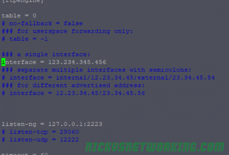

# Installation of RTPEngine on Debian 10

## 1) Clone the RTPEngine fro github And get into rtpengine folder

      git clone https://github.com/sipwise/rtpengine.git
      
      cd rtpengine 
      
      
 ## 2) Install the dependancies
 
      apt install debhelper default-libmysqlclient-dev gperf iptables-dev libavcodec-dev libavfilter-dev libavformat-dev libavutil-dev libbencode-perl libcrypt-openssl-rsa-perl libcrypt-rijndael-perl libhiredis-dev libio-multiplex-perl libio-socket-inet6-perl libjson-glib-dev libdigest-crc-perl libdigest-hmac-perl libnet-interface-perl libnet-interface-perl libssl-dev libsystemd-dev libxmlrpc-core-c3-dev libcurl4-openssl-dev libevent-dev libpcap0.8-dev markdown unzip nfs-common dkms libspandsp-dev libavcodec-extra
      
      
## 2) Get the G.729 library And Build it manually

      VER=1.0.4

      curl https://codeload.github.com/BelledonneCommunications/bcg729/tar.gz/$VER >bcg729_$VER.orig.tar.gz

      tar zxf bcg729_$VER.orig.tar.gz 

      cd bcg729-$VER 

      git clone https://github.com/ossobv/bcg729-deb.git debian 

      dpkg-buildpackage -us -uc -sa

      cd ../

      dpkg -i libbcg729-*.deb
      

  Now let’s check the RTPengine dependencies again:

      dpkg-checkbuilddeps
    
  If you get an empty output you’re good to start building the packages:
  
      dpkg-buildpackage 

  
  If that completed sucessfully in the directory above you should have a bunch of .deb files:
  
  
      cd ../

      dpkg -i ngcp-rtpengine-daemon_*.deb ngcp-rtpengine-iptables_*.deb ngcp-rtpengine-kernel-dkms_*.deb 
    
    
 ## Getting it Running

Now we’ve got RTPengine installed let’s setup the basics,

There’s an example config file we’ll copy and edit:

      mv /etc/rtpengine/rtpengine.sample.conf /etc/rtpengine/rtpengine.conf

      vi /etc/rtpengine/rtpengine.conf
      
We’ll uncomment the interface line and set the IP to the IP we’ll be listening on:

Once we’ve set this to our IP we can start the service:

      /etc/init.d/ngcp-rtpengine-daemon start
      
      
