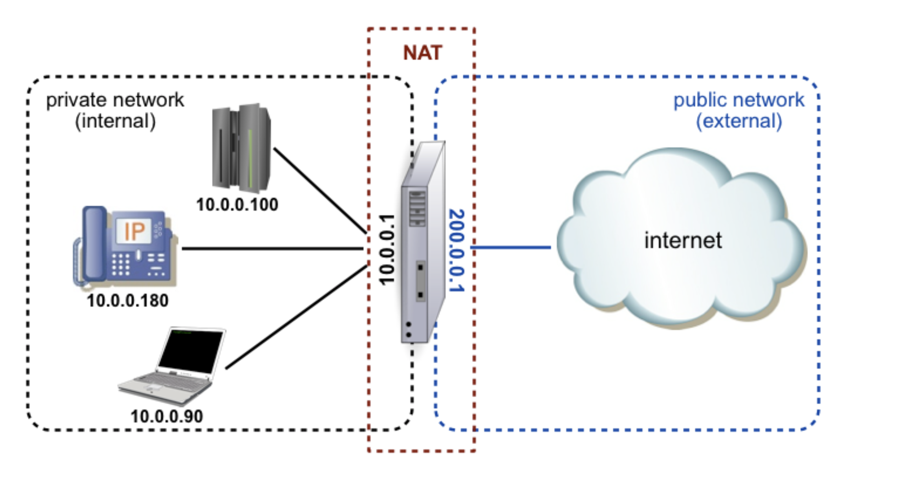
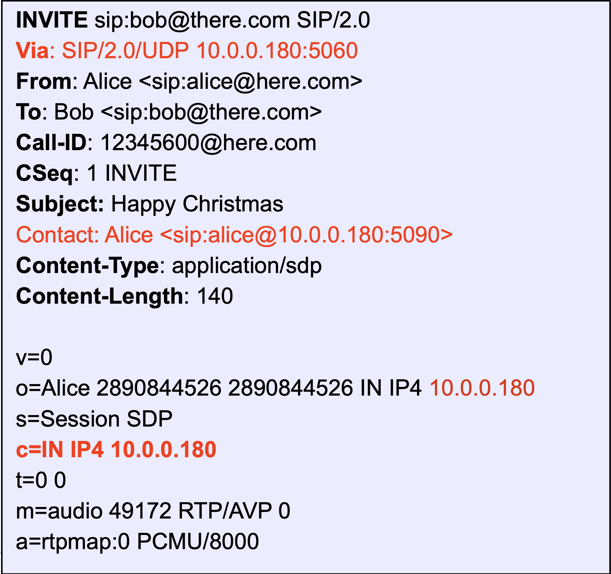
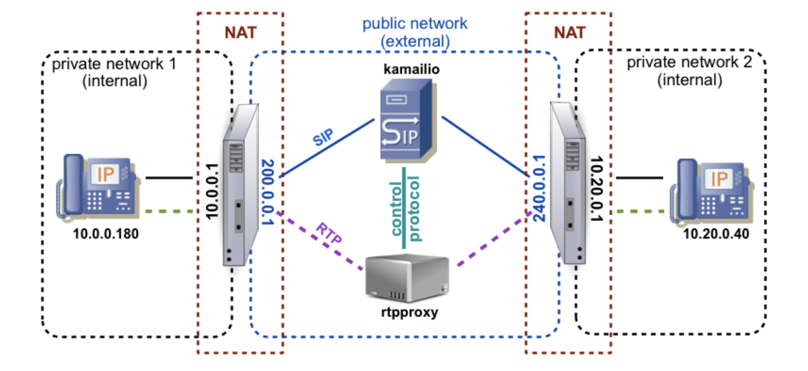
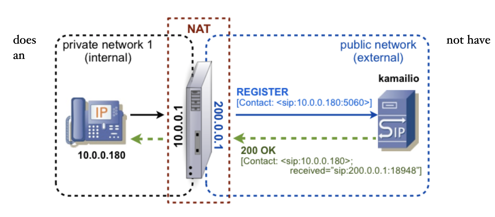

# NAT Traversal

## NAT OVERVIEW (VUE D'ENSEMBLE DU NAT)

La traduction d'adresse réseau (NAT) est le mécanisme par lequel un dispositif de réseau, un routeur ou un pare-feu, agit comme intermédiaire entre deux réseaux, généralement un privé et un public, en redirigeant une ou plusieurs adresses publiques vers différents nœuds du réseau privé.

En pratique, tout paquet provenant d'un appareil du réseau privé est considéré comme provenant du routeur NAT par les appareils du réseau public.
Dans le schéma ci-dessus, le routeur NAT a deux interfaces de réseau :
- une interface externe avec l'IP public 200.0.0.1 pour se connecter à Internet
- interface interne avec l'IP privé 10.0.0.1 pour se connecter au réseau privé
Les plages d'adresses IP pouvant être utilisées pour les réseaux privés sont définies par la RFC1918. Ces plages sont les suivantes : 

* **10.0.0.0 - 10.255.255.255** (network mask 10/8)
* **172.16.0.0 - 72.31.255.255** (network mask 172.16/12)
* **192.168.0.0 - 192.168.255.255** (network mask 192.168/16)

Le NAT est défini pour les réseaux IPv4 uniquement et il est censé ne pas être utilisé dans les réseaux IPv6.
Mais beaucoup utilisent le NAT comme un mécanisme de sécurité, non pas à cause de la pénurie d'adresses IPv4, donc
nous pouvons voir des topologies de réseau similaires à la NAT dans IPv6, heureusement IPv6 a suffisamment d'adresses pour ne pas être aussi complexe que dans IPv4.

### TYPES OF NAT (TYPES DE NATURE)

Les routeurs NAT peuvent avoir différentes politiques pour faire correspondre les adresses privées aux adresses publiques, en étant classés par catégories :
- **full cone NAT (NAT à cône complet)** - il s'agit d'une mise en correspondance biunivoque entre l'adresse IP publique et un port du routeur NAT et une adresse IP privée et un port d'un appareil du réseau privé. Il permet les connexions entrantes à partir de dispositifs externes, ce qui constitue le type de NAT le moins restrictif, connu également sous le nom de "port forwarding".
- **restricted cone NAT (NAT à cône restreint)** - il est similaire au NAT à cône complet, mais il exige que le dispositif à l'intérieur du réseau privé initie la communication. Par conséquent, aucun appareil du réseau public ne peut envoyer de paquets à un appareil situé derrière le routeur NAT avant d'en recevoir un.
- **port restricted NAT (NAT à port restreint)** - cela ajoute une restriction sur le port source des paquets provenant d'appareils externes. Si le dispositif du réseau privé envoie les paquets à un port spécifique d'un dispositif du réseau public, ce dispositif doit utiliser le même port pour renvoyer le trafic.
- **symmetric NAT (NAT symétrique)** - il s'agit du type de NAT le plus restrictif, qui applique des restrictions sur l'IP et le port des deux appareils des deux côtés. L'attribution des ports sur l'interface publique du routeur NAT se fait de manière aléatoire et généralement pour une durée limitée, la cartographie de traduction étant détruite au bout d'un certain temps s'il n'y a pas de trafic en provenance de l'appareil dans le réseau privé. Les ports alloués sont différents même lorsque le dispositif du réseau privé utilise la même IP et le même port mais envoie vers des dispositifs ou des ports différents dans le réseau public.

## SIP AND NAT (NAT ET SIP)

Les communications utilisant le SIP impliquent dans la plupart des cas deux canaux ou plus : 
- **le canal de signalisation (signaling channel)**, qui sont des paquets SIP
- **les canaux médiatiques (media channels)**, généralement des paquets RTP (par exemple, pour la voix, la vidéo)

Lorsqu'un SIP **UA** construit **un message SIP**, il utilise l'IP et le **port local** pour créer des en-têtes tels que **Via** ou **Contact**. Lorsque l'appareil se trouve derrière un routeur NAT, l'IP locale n'est pas routable depuis le réseau externe. Si le serveur SIP se trouve sur le réseau public, cela signifie que les demandes et les réponses SIP ne peuvent pas être renvoyées à **l'UA** en suivant simplement **les adresses des en-têtes** classiques **Via** ou **Contact**.
Ensuite, INVITE met en évidence l'endroit où une traversée NAT se reflète dans le message SIP.

Traversée NAT suivant les attributs des messages SIP :
- l'adresse dans l'en-tête **Via**
- l'adresse dans l'en-tête **Contact**
- adresse pour le flux média dans le **SDP** (ligne c=)
- dans les attributs de l'origine dans le **SDP** (ligne o=) - celui-ci n'est pas important pour la communication, mais certains UA doivent être identiques à ceux de la ligne c=.

Un autre test qui peut être effectué pour détecter un routeur NAT entre le serveur UA et le serveur SIP consiste à comparer l'IP et le port source du paquet réseau avec l'IP et le port de l'en-tête Via. Ceci est pratiquement utile pour les UA utilisant STUN mais passant par une NAT symétrique.
Les communications via tous les types de routeurs NAT impliquent une manipulation spéciale sur le serveur SIP, respectivement :

- stockage de l'IP source, du port et du protocole du paquet réseau entrant
- le stockage de l'IP, du port et du protocole de la socket locale où le paquet réseau a été reçu

Au lieu d'envoyer des paquets en utilisant les adresses de Via (pour les réponses SIP) ou de Contact (pour les demandes SIP), le serveur SIP utilisera l'IP, le port et le protocole source. Pour s'assurer que les paquets sont autorisés par des routeurs NAT symétriques, la même socket locale où le paquet a été reçu doit être utilisée pour renvoyer les paquets à UA.

### NAT TRAVERSAL OPTIONS (OPTIONS DE TRAVERSÉE Du NAT)

Il existe plusieurs options qui peuvent être essayées pour rendre les sessions SIP connectées par NAT. Elles peuvent impliquer le côté client, le côté serveur ou une combinaison des deux.

Parmi les solutions côté client :
- **STUN** - défini comme la simple traversée du protocole de datagramme utilisateur (UDP) par des traducteurs d'adresses réseau (NAT) dans la RFC3489. En pratique, l'UA SIP doit contacter un serveur STUN avant de lancer la session SIP. Le serveur STUN répond avec l'IP et le port externe du routeur NAT, tels qu'ils sont découverts à partir de l'adresse source du paquet réseau. Ensuite, l'UA utilise les valeurs reçues du serveur STUN pour construire les messages SIP. Cette solution n'est pas adaptée au passage par des routeurs NAT symétriques.
- **Routeur ALG** (Application Level Gateway) - certains routeurs NAT intègrent un ALG SIP, qui intercepte de manière transparente les messages SIP et met à jour les adresses privées des UA avec celle de l'extérieur utilisée pour la communication. Le gros problème est que la plupart de ces routeurs ont des implémentations SIP ALG cassées, cassant tout si mal que la seule solution est de désactiver cette fonctionnalité dans le routeur.
- **Règle de transfert statique (Static transfer rule)** - si le routeur NAT fournit des règles de transfert, celles-ci peuvent être utilisées pour transférer les messages SIP aux UA. Les UA doivent également avoir la possibilité de configurer une adresse externe.

Parmi les solutions côté serveur :
- **Correction de la signalisation par le serveur SIP et le relais RTP** - c'est une solution qui ne nécessite rien du côté client et qui fonctionne dans la plupart des cas (à l'exception des routeurs SIP ALG défectueux). Le serveur SIP met à jour les en-têtes pour rendre la communication possible et utilise un relais RTP pour transmettre le flux média par l'intermédiaire d'un nœud public. Le seul inconvénient de cette solution est que le RTP est relayé par l'infrastructure du serveur SIP, ce qui expose la communication à des retards supplémentaires et consomme plus de bande passante du point de vue du fournisseur. C'est la solution présentée plus loin dans ce chapitre, qui est utilisée par Kamailio.
- **TURN** - défini comme **T**raversal **U**sing **R**elays around **N**AT (TURN) dans la RFC5766 - il nécessite que les serveurs TURN soient installés dans des nœuds publics pour relayer les paquets RTP. Avant de lancer la session SIP, l'UA contacte un serveur TURN pour ouvrir les canaux de communication et en fait la publicité dans la signalisation SIP. Les serveurs TURN recevront les paquets RTP de l'autre partie et les relaieront à UA par les canaux appropriés.
- **COMEDIA** - **C**onnection **O**riented **Media** - est un mécanisme qui nécessite que le RTP symétrique et l'une des deux parties d'un appel VoIP soient situés dans un nœud public. Concrètement, COMEDIA spécifie au nœud public d'ignorer les attributs de connexion dans SIP SDP et d'envoyer les paquets RTP à l'adresse d'où il a reçu les paquets RTP de l'autre partie. De nombreuses passerelles **SIP-PSTN** ou **serveurs de médias** prennent en charge cette extension, permettant une communication directe entre l'UA derrière le routeur NAT et eux.
- **Les SBC** - **S**ession **B**order **C**ontroller sont pratiquement des systèmes SIP ALG déployés dans les nœuds publics. L'UA doit envoyer le trafic à SBC, qui fixe la signalisation avant de l'envoyer au serveur SIP. Un SBC peut relayer les paquets RTP chaque fois que cela est nécessaire ou obligatoire.

En plus de plusieurs de ces options est défini ICE (Interactive Connectivity Establishment), par RFC5245. Il s'agit d'un mécanisme qui tente de détecter la meilleure option à utiliser pour la traversée NAT, comme STUN, TURN ou Realm Specific IP (RSIP). Il exige que l'UA mette en œuvre le cadre de négociation ICE, qui n'est pas encore présent dans de nombreux UA SIP déployés.

## KAMAILIO AND NAT TRAVERSAL (KAMAILIO ET LA TRAVERSÉE DU NAT)

Du point de vue de Kamailio, la gestion de la traversée du NAT implique plusieurs opérations : 

- détecter si la demande SIP vient de derrière un routeur NAT
- la détection des demandes SIP qui doivent être transmise derrière un routeur NAT
- sauvegarder les informations sur l'état naturel d'un UA dans un registre de localisation
- **mettre à jour les en-têtes SIP** afin de rendre possible la traversée NAT pour les sessions SIP
- d'engager une application de relais RTP afin de mandater les flux de médias

Le Kamailio propose peu d'options comme solution pour le passage du NAT :

- **nathelper** et module **rtpproxy** utilisés avec l'application RTPProxy 
- module **iptrtpproxy** utilisé avec les règles de transfert RTP basées sur le noyau 
- module **mediaproxy** utilisé avec l'application mediaproxy

Dans ce livre, nous nous concentrons sur la première option, qui est largement utilisée et fournie comme solution de traversée NAT dans le fichier de configuration par défaut de Kamailio.

### NATHELPER MODULE (MODULE NATHELPER)

Ce module exporte dans un fichier de configuration les fonctions pour

- détecter lorsqu'un message SIP provient d'un réseau situé derrière un routeur NAT 
- modifier le contenu des messages SIP pour les faire passer par les routeurs NAT.
En interne, il s'occupe également de l'envoi de paquets keepalives aux contacts NATés, en offrant un paramètre de configuration à envoyer à tous les contacts.
Son fichier Readme en ligne est disponible à l'adresse suivante :

• http://kamailio.org/docs/modules/4.2.x/modules/nathelper.html

La décision de savoir si un paquet SIP provient de derrière un routeur NAT est prise sur la base d'un ensemble de tests sélectionnés par le rédacteur du fichier de configuration et fournis sous forme de combinaison binaire dans le paramètre de la fonction nat_uac_test().

Les tests possibles sont les suivants :
- 1 - **adresse de contact privée (private contact address)** - l'adresse d'en-tête du contact est testée pour voir si elle a une IP privée dans la rage définie par la RFC1918
- 2 - **discordance de l'adresse source (source address mismatch)** - l'adresse IP dans Via est comparée à l'adresse IP source du paquet réseau

- 4 - **private via address (private via address)** - l'en-tête "top most via" est testé pour voir si l'adresse IP privée est conforme à la norme RFC1918
- 8 - **adresse média privée (private media address)** - l'adresse IP du flux média dans le corps du SDP est testée pour voir s'il s'agit d'une adresse RFC1918
- 16 - **discordance du port source (source port mismatch)** - le port dans l'en-tête Via est comparé avec le port source du paquet réseau
- 32 - **adresse source privée (private source address)** - l'adresse IP source du paquet réseau est testée pour voir s'il s'agit d'une adresse RFC1918

nat_uac_test() renvoie vrai si l'un des tests recherchés est vrai. Faire tous les tests est un appel :

    nac_uac_test(“63”);

La manipulation du message SIP est liée à la modification des adresses des flux de médias ou des en-têtes de contact. Cela peut être fait avec :
- **fix_nated_sdp(...)** - remplace l'adresse IP du flux média par l'IP source du paquet réseau ou par un paramètre fourni. Elle n'est pas très souvent utilisée, la mise à jour de l'adresse IP du flux média étant effectuée par la fonction qui contrôle l'application de relais RTP.
- **fix_nated_contact()** - remplace l'adresse dans l'en-tête du contact par l'IP source, le port et le protocole du paquet réseau. Elle présente l'inconvénient que certains **AO** rejettent les demandes ultérieures dans le dialogue qui présentent une adresse R-URI différente de celle qu'ils ont définie dans l'en-tête Contact
- **add_rcv_param(...)** - ajoute un paramètre nommé received à l'en-tête Contact ou à son adresse, en stockant l'IP source, le port et le protocole du paquet réseau. La valeur peut être utilisée par le proxy dans des scénarios de réplication ou pour construire l'adresse où envoyer des requêtes sous-séquentes dans le dialogue, via des règles manuelles dans les fichiers de configuration.
- **set_contact_alias()** - ajoute un paramètre appelé "alias" à l'adresse du contact où l'IP source, le port et le protocole du paquet réseau sont stockés dans un format codé

La mise à jour de l'adresse de l'en-tête du contact est nécessaire pour pouvoir acheminer les demandes dans le dialogue, étant nécessaire pour stocker d'une manière ou d'une autre l'IP source, le port et le protocole utilisés par le routeur NAT. L'adresse du contact dans la réponse INVITE ou 200 ok est utilisée dans l'URI de la requête pour les prochains messages du même dialogue (par exemple, ACK, BYE).

La méthode recommandée pour mettre à jour l'en-tête Contact est d'utiliser **add_contact_alias()**. La solution fournie par cette fonction conserve l'adresse de contact de l'UA d'origine ainsi que les détails à envoyer au routeur NAT. Le module exporte également la fonction **handle_ruri_alias()** qui décode le paramètre "alias" et définit l'adresse de destination (sortante) appropriée (qui est le routeur NAT) et demande l'URI (l'adresse de l'en-tête Contact de l'UA) afin de traverser les routeurs NAT sans être rejeté par l'UA. Ce paramètre est utilisé dans le fichier de configuration par défaut et est détaillé dans l'une des sous-sections suivantes.
Le mécanisme d'envoi de paquets keepalive pour empêcher le routeur NAT de détruire la mise en correspondance des adresses (fermer le trou d'épingle) peut être contrôlé par un ensemble de paramètres de module, les plus pertinents étant
- **natping_interval** - la fréquence d'envoi des paquets keepalive
- **natping_processus** - combien de processus dédiés sont lancés pour envoyer les paquets keepalive. Si plus d'un processus est lancé, la charge est répartie entre eux.

### RTPPROXY MODULE (MODULE RTPPROXY)

Ce module offre les outils permettant de contrôler l'application RTPProxy pour le relais des flux de médias et de mettre à jour les parties correspondantes dans la signalisation SIP. La documentation du module est disponible en ligne à l'adresse suivante
- http://kamailio.org/docs/modules/4.2.x/modules/rtpproxy.html 

Parmi les fonctionnalités fournies :
- la possibilité d'équilibrer la charge des flux à travers un groupe d'applications RTPProxy 
- la possibilité de travailler avec de nombreux groupes d'applications RTPProxy
- la capacité à établir un pont entre les flux de médias entre les réseaux (par exemple, du réseau privé au réseau public ou d'IPv4 à IPv6)
- possibilité de sauvegarder le flux média localement
- possibilité de diffuser des paquets RTP dans le cadre d'un appel (par exemple, musique d'attente) 
- possibilité d'exécuter une commande RPC en cas de dépassement du délai RTP
- re-packettisation du trafic RTP

En ce qui concerne la traversée NAT, les opérations effectuées par le module sont les suivantes :
- contacter le RTPProxy pour récupérer l'adresse IP et les ports à utiliser pour le relais des paquets RTP
- mettre à jour le corps du SDP avec les attributs reçus de RTPProxy
- ajouter une ligne de marquage "a=nortpproxy:yes" pour signaler qu'un relais RTP est utilisé pour l'appel 
- dire à l'application RTPProxy de détruire une session de relais de flux média
L'une des fonctions exportées par le module est rtpproxy_manage(...). Elle est utilisée dans le fichier de configuration par défaut et tente de traiter automatiquement les cas les plus courants. D'autres fonctions exportées telles que **rtpproxy_offer()**, **rtpproxy_answer()** ou **unforce_rtp_proxy()** peuvent être utilisées lorsque davantage de contrôle est nécessaire pour gérer le trafic SIP.

La fonction **rtpproxy_manage(...)** a deux paramètres optionnels :
- **flags** - il contrôle le comportement interne sur ce qui doit être mis à jour et l'interaction avec l'application RTPProxy - les valeurs possibles sont documentées dans le readme du module (lien vers celui-ci fourni ci-dessus)
- **ipaddr** - l'adresse IP qui doit être utilisée pour mettre à jour le corps du SDP
Selon le type de la requête SIP ou le code de la réponse SIP, la fonction rtpproxy_manage(...) donne à l'application RTPProxy l'instruction de lancer, de démarrer ou de détruire une session de relais de flux de médias.

### RTPPROXY APPLICATION (APPLICATION RTPPROXY)

RTPProxy est une application open source écrite en C utilisée pour relayer les paquets RTP. La page web du projet est :
- http://www.rtpproxy.org

Kamailio contrôle RTPProxy par le biais d'un protocole personnalisé, en interagissant avec lui pour :

- ouvrir une session de relais RTP 
- mettre à jour une session de relais RTP 
- terminer une session de relais RTP

Le schéma ci-dessus montre la relation entre les terminaux, les routeurs NAT, Kamailio et le proxy RTP pendant une session de communication en temps réel. Le canal de signalisation des messages SIP passe par Kamailio et le canal média des paquets RTP passe par le proxy RTP.
Outre le simple relais des paquets RTP UDP, prêt à l'emploi ou via des correctifs dans le domaine public, RTPProxy offre d'autres fonctionnalités telles que l'enregistrement des flux RTP, le paiement de musique d'attente, la reconditionnement ou des commandes de rappel pour le timeout RTP.

### RTPPROXY INSTALLATION

Le plus simple est d'installer RTPProxy à partir d'un paquet, faisant partie de nombreuses distributions Linux. Pour Debian/Ubuntu, la commande est:

    apt-get install rtpproxy

rtpproxy n'a pas de fichier de configuration, tous les paramètres sont pris en ligne de commande.
Vous devez personnaliser la prise de contrôle à utiliser pour communiquer avec Kamailio, ce qui doit être fourni par le paramètre de ligne de commande '-s'. Par défaut, il s'agit d'un fichier de socket unix. Le fichier de configuration de Kamailio donne un exemple avec un socket réseau qui doit être utilisé lorsque RTPProxy fonctionne sur une machine différente de Kamailio. Par exemple, en utilisant 127.0.0.1 et le port 7722 pour communiquer avec Kamailio :

    rtpproxy -s udp:127.0.0.1:7722 ...

L'installation des sources requiert les opérations standard pour toute application Linux : téléchargement, configuration, création et installation :

    mkdir -p /usr/local/src/rtpproxy
    cd /usr/local/src/rtpproxy
    wget http://b2bua.org/chrome/site/rtpproxy-1.2.1.tar.gz tar xvfz rtpproxy-1.2.1.tar.gz
    cd rtpproxy-1.2.1
    ./configure
    make
    make install

L'application Rtpproxy est déployée sur `/usr/local/bin/rtpproxy`.
Un des chapitres suivants montre comment la démarrer pour l'utiliser avec le fichier de configuration par défaut de Kamailio.

## REGISTRATION THROUGH NAT (ENREGISTREMENT PAR LE BIAIS DE NAT)

L'enregistrement SIP est effectué par le SIP UA pour faire connaître leur emplacement physique en termes d'IP, de port et de protocole. Lorsque l'UA est derrière le NAT, l'IP est privée, et non pas routable depuis le réseau public. Il ne suffit pas de conserver uniquement la relation entre l'adresse **AoR** et **l'adresse de contact de l'UA** pour pouvoir envoyer des appels ou d'autres demandes SIP à cet UA.
L'implémentation du bureau d'enregistrement de Kamailio (registrar) stocke dans l'emplacement les attributs nécessaires pour pouvoir acheminer les demandes via le routeur NAT vers l'UA, respectivement :

- dans la colonne reçue, il stocke l'IP source, le port et le protocole du paquet réseau, qui est pratiquement la prise externe du routeur NAT
- dans la colonne socket, il stocke l'IP, le port et le protocole de la socket locale où le paquet réseau a été reçu

Le schéma ci-dessus montre le flux de messages pour un enregistrement SIP impliquant un routeur NAT au milieu - l'en-tête Contact dans la réponse 200 OK inclut le paramètre received qui reflète l'adresse IP du routeur NAT et le port utilisé pour la communication avec Kamailio.
Lorsque Kamailio en tant que bureau d'enregistrement est déployé derrière un autre proxy SIP, les sauts intermédiaires doivent alors ajouter les en-têtes Path afin de faire fonctionner la traversée NAT. Kamailio stocke la liste des en-têtes Path dans la colonne Path.
Un enregistrement par NAT est reflété dans la demande d'enregistrement suivante et sa réponse.

    REGISTER sip:kamailio.lab SIP/2.0
    Via: SIP/2.0/UDP 10.0.0.180:57207;rport;branch=z9hG4bKPjfD55KnvC7LEjXL7C6Rgi.zwCYu8FzQ3i Max-Forwards: 70
    From: <sip:alice@kamailio.lab>;tag=84x96mIBMpd00z8EnRsbYHib7F9PKEG7
    To: <sip:alice@kamailio.lab>
    Call-ID: SrIV6iMvJNePTjMMeI4amEGW5s7dke8F
    CSeq: 64683 REGISTER
    User-Agent: myphone
    Contact: <sip:alice@10.0.0.180:57207>
    Expires: 300
    Content-Length: 0
    .....
    SIP/2.0 200 OK
    Via: SIP/2.0/UDP 10.0.0.180:57207;rport=57207;
        branch=z9hG4bKPjfD55KnvC7LEjXL7C6Rgi.zwCYu8FzQ3i;received=200.0.0.1 From: <sip:alice@kamailio.lab>;tag=84x96mIBMpd00z8EnRsbYHib7F9PKEG7
    To: <sip:alice@kamailio.lab>;tag=b27e1a1d33761e85846fc98f5f3a7e58.cc51
    Call-ID: SrIV6iMvJNePTjMMeI4amEGW5s7dke8F
    CSeq: 64683 REGISTER
    Contact: <sip:alice@10.0.0.180:57207>;expires=300;received="sip:200.0.0.1:18948" Server: kamailio (4.0.2 (x86_64/linux))
    Content-Length: 0

La demande d'enregistrement (REGISTER request) contient l'adresse IP privée du téléphone d'Alice dans **Via** et **Contact**. Kamailio ajoute à la réponse SIP **l'IP source** et le **port de Via** (dans les paramètres rport et received) ainsi que **l'en-tête de Contact** (dans le paramètre received).
**L'UA** indique par le paramètre **rport** vide dans **REGISTER** qu'il veut être informé dans la réponse de l'IP source et du port des demandes, une extension SIP définie dans la RFC3581.
Lorsqu'un appel est dirigé vers l'UA respectif, au lieu d'envoyer à l'adresse du contact à partir de l'enregistrement de localisation, Kamailio envoie l'INVITE à l'adresse stockée dans la colonne reçue. Le routeur NAT reçoit le message SIP et le transmet à l'UA dans le réseau privé, en fonction de ses règles internes de mise en correspondance des adresses.
Comme de nombreux routeurs NAT détruisent les relations de mappage d'adresses s'il n'y a pas de trafic, Kamailio peut être configuré pour envoyer des paquets **keepalive**, sous forme de données **UDP factices** ou de **demandes SIP OPTIONS**. Le second consomme plus de bande passante, mais crée un trafic entrant et sortant par le trou d'épingle du routeur NAT, ce qui est la solution pour les routeurs NAT très restrictifs qui nécessitent un trafic sortant pour maintenir le trou d'épingle ouvert.
Il existe des implémentations SIP UA qui peuvent également envoyer des paquets keepalive, option qu'il est préférable d'utiliser car elle répartit la charge de construction et d'envoi de ces paquets. Parmi les autres options envisagées pour garder le trou d'épingle NAT ouvert, on peut réduire le temps d'enregistrement à de courts intervalles, par exemple toutes les 30 secondes. Mais cette solution peut surcharger le serveur du bureau d'enregistrement SIP, car les enregistrements de localisation sont mis à jour chaque fois qu'un REGISTRE (REGISTER) demande à être enregistré.

