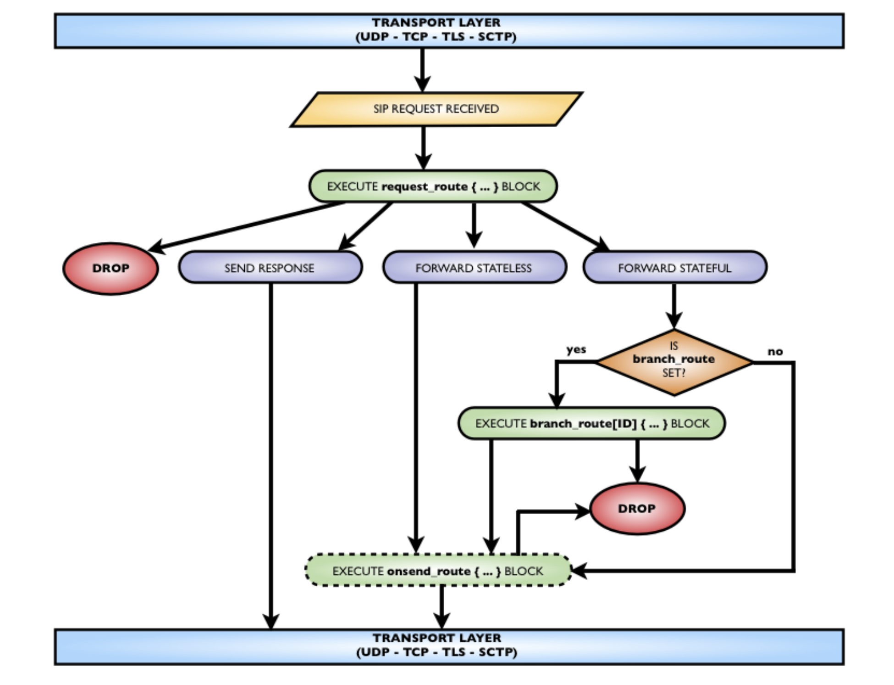
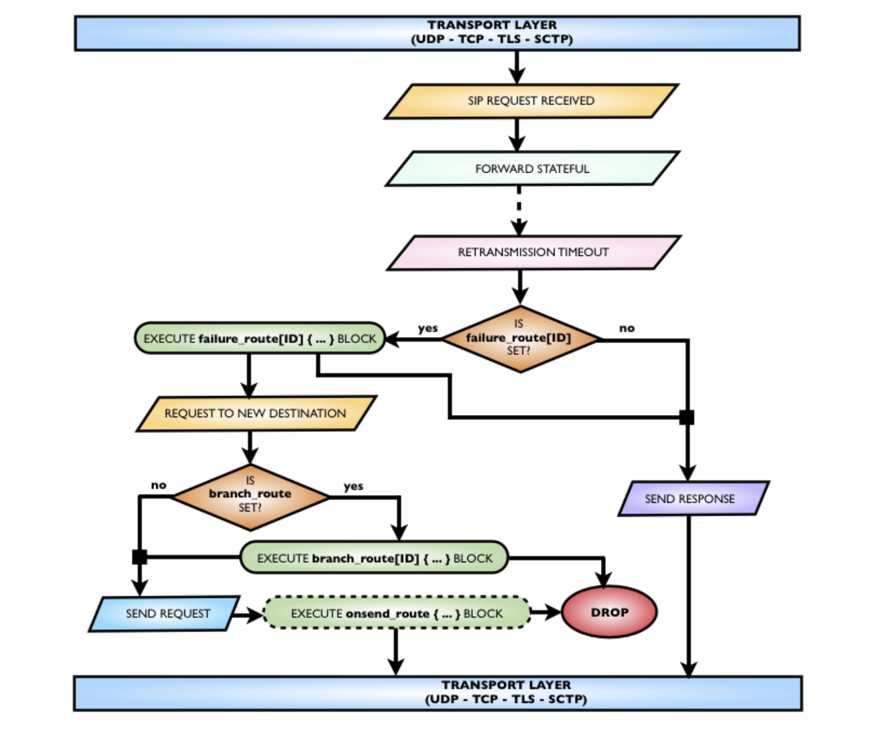

# SIP Message Routing (Acheminement des messages SIP)

Ce court chapitre présente les diagrammes qui montrent la relation entre les blocs de routage des fichiers de configuration et le traitement des messages SIP.

## SIP REQUEST ROUTING (ROUTAGE DES DEMANDES SIP)

Lorsqu'une demande SIP est reçue du réseau, le traitement suivant peut se produire en relation avec les blocs de routage du fichier de configuration.

Il commence par l'exécution du bloc request_route et peut se terminer par : 
  - abandonner la demande
  - envoyer une réponse
  - en avant en mode apatride
  - en mode "stateful", ce qui peut entraîner :
      - l'exécution d'un embranchement
      - l'abandon de la branche sortante
  - avant d'écrire au réseau la demande transmise, le bloc optionnel onsend_route peut être exécuté, ce qui donne la dernière chance d'abandonner la demande

## SIP REQUEST ROUTING ON RETRANSMISSION TIMEOUT (ROUTAGE DES DEMANDES SIP EN CAS DE DÉPASSEMENT DU DÉLAI DE RETRANSMISSION)

Si la demande a été transmise en mode "stateful" via UDP, Kamailio lancera un timer de retransmission, en renvoyant la demande périodiquement jusqu'à ce qu'une réponse soit reçue ou que le timer se déclenche. Un second timer attend une réponse finale dans un intervalle de temps donné, si ce n'est pas le déclenchement d'un autre timer de retransmission.

## SIP RESPONSE ROUTING (SIP RESPONSE ROUTING)

