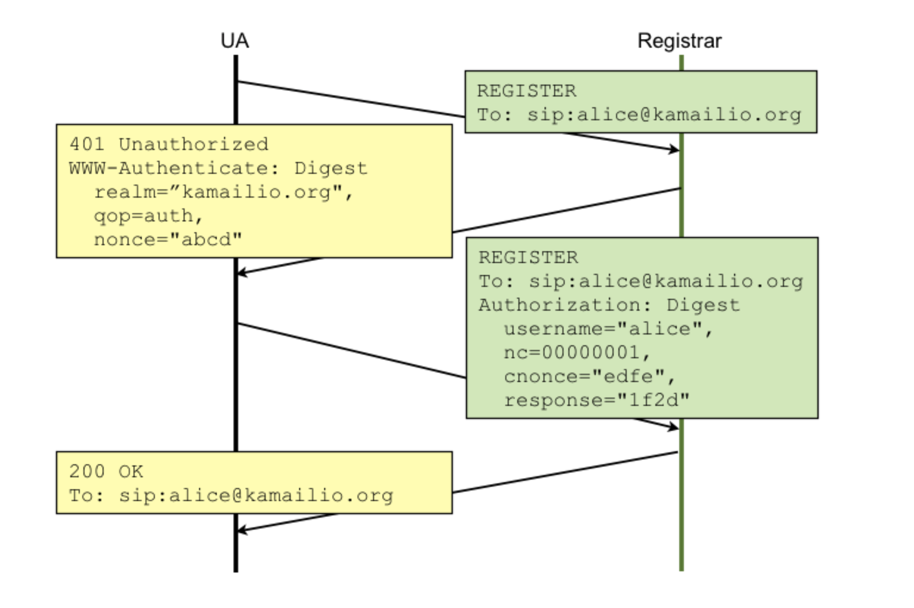
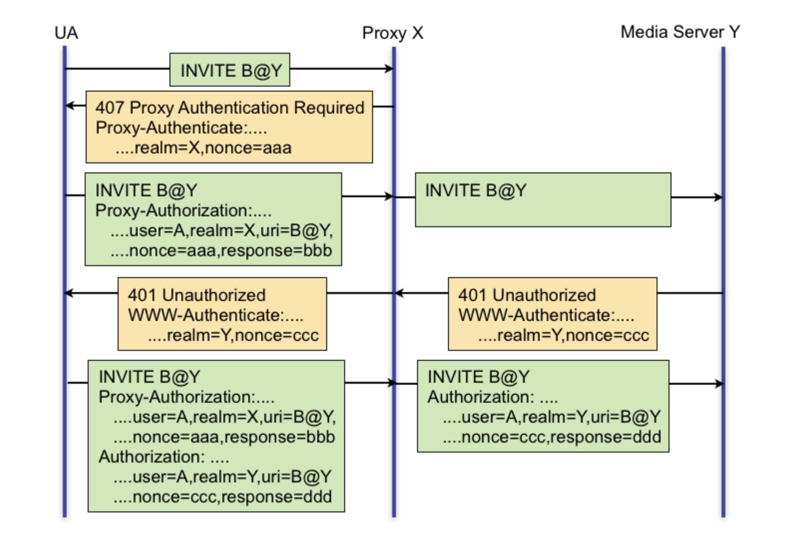

# User Authentication (Authentification d'utilisateur)

## SIP AUTHENTICATION OVERVIEW (APERÇU DE L'AUTHENTIFICATION SIP)

Le mécanisme d'authentification des utilisateurs pour le SIP est emprunté à HTTP, respectivement à l'authentification www digest - RFC2617. Il s'agit d'un paradigme défi-réponse :

* UA envoie la demande sans aucun justificatif d'authentification
* le serveur répond avec un défi, en ajoutant l'en-tête avec les attributs à utiliser pour
construire des justificatifs d'authentification
* UA envoie à nouveau la demande en ajoutant l'en-tête avec les données d'authentification - le serveur accepte ou refuse l'authentification
Si le serveur est le point de terminaison (par exemple, le bureau d'enregistrement), il doit demander l'autorisation www, en répondant par une réponse 401. Si le serveur est un relais (par exemple, un proxy), il doit demander l'autorisation du proxy, en répondant par 407.
Le diagramme suivant montre le flux de messages SIP d'autorisation www pour l'enregistrement sur le serveur kamailio.org et les en-têtes impliqués dans le processus :

Sur le chemin de l'appelant à l'appelé, une demande SIP peut être contestée pour authentification par de nombreux sauts. Il n'y a pas beaucoup de téléphones SIP qui supportent de tels scénarios, mais c'est quelque chose de possible du point de vue des spécifications. Il est plus courant que l'utilisateur s'authentifie avec un serveur (son serveur d'origine) et les nœuds intermédiaires suivants dans le chemin se font confiance par adresse IP.
Le schéma suivant montre un cas de double authentification, l'une par un proxy et l'autre par un serveur de médias (qui termine l'appel) :

Les réponses SIP demandant l'authentification portent des en-têtes spéciaux avec les attributs à utiliser pour construire la réponse d'authentification. Il s'agit de
* **WWW -Authenticate**, dans la réponse **401**
* **Proxy-Authenticate**, dans la réponse **407**
En réponse à un défi d'authentification, les demandes portent les références dans différents  en-têtes :
* **Autorisation**, dans les demandes faisant suite à une contestation **401**
* **Proxy-Autorisation**, dans les demandes faisant suite à une contestation **407**
Les attributs (également appelés paramètres) des en-têtes sont les mêmes, pour les réponses SIP comme pour les demandes SIP, **seul le nom des en-têtes est différent**.
