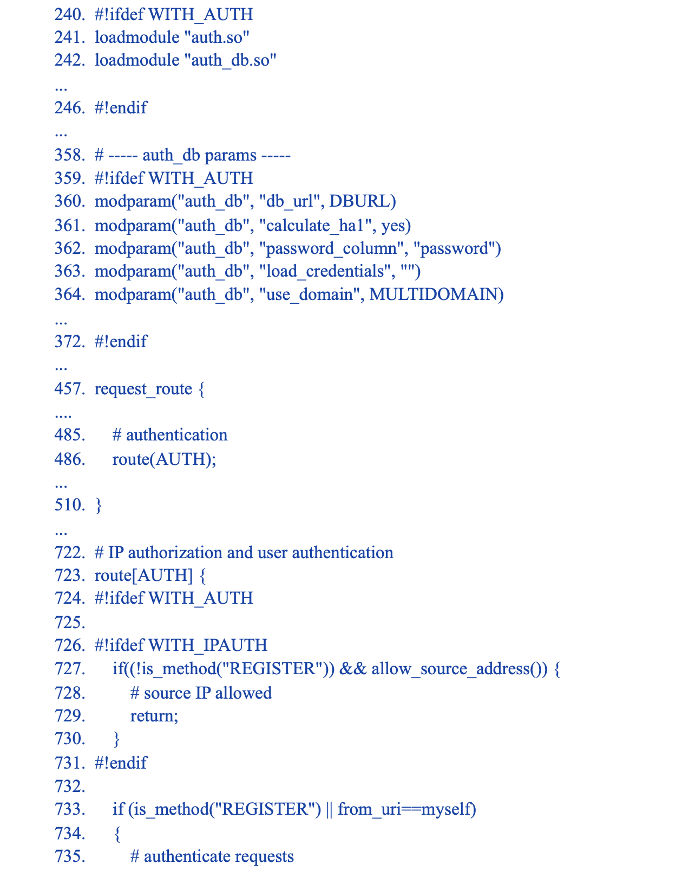
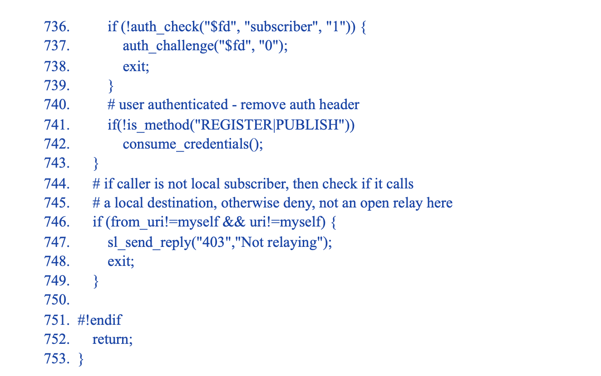

# User Authentication (Authentification d'utilisateur)

## SIP AUTHENTICATION OVERVIEW (APERÇU DE L'AUTHENTIFICATION SIP)

Le mécanisme d'authentification des utilisateurs pour le SIP est emprunté à HTTP, respectivement à l'authentification www digest - RFC2617. Il s'agit d'un paradigme défi-réponse :

* UA envoie la demande sans aucun justificatif d'authentification
* le serveur répond avec un défi, en ajoutant l'en-tête avec les attributs à utiliser pour
construire des justificatifs d'authentification
* UA envoie à nouveau la demande en ajoutant l'en-tête avec les données d'authentification - le serveur accepte ou refuse l'authentification
Si le serveur est le point de terminaison (par exemple, le bureau d'enregistrement), il doit demander l'autorisation www, en répondant par une réponse 401. Si le serveur est un relais (par exemple, un proxy), il doit demander l'autorisation du proxy, en répondant par 407.
Le diagramme suivant montre le flux de messages SIP d'autorisation www pour l'enregistrement sur le serveur kamailio.org et les en-têtes impliqués dans le processus :

Sur le chemin de l'appelant à l'appelé, une demande SIP peut être contestée pour authentification par de nombreux sauts. Il n'y a pas beaucoup de téléphones SIP qui supportent de tels scénarios, mais c'est quelque chose de possible du point de vue des spécifications. Il est plus courant que l'utilisateur s'authentifie avec un serveur (son serveur d'origine) et les nœuds intermédiaires suivants dans le chemin se font confiance par adresse IP.
Le schéma suivant montre un cas de double authentification, l'une par un proxy et l'autre par un serveur de médias (qui termine l'appel) :

Les réponses SIP demandant l'authentification portent des en-têtes spéciaux avec les attributs à utiliser pour construire la réponse d'authentification. Il s'agit de
* **WWW -Authenticate**, dans la réponse **401**
* **Proxy-Authenticate**, dans la réponse **407**
En réponse à un défi d'authentification, les demandes portent les références dans différents  en-têtes :
* **Autorisation**, dans les demandes faisant suite à une contestation **401**
* **Proxy-Autorisation**, dans les demandes faisant suite à une contestation **407**
Les attributs (également appelés paramètres) des en-têtes sont les mêmes, pour les réponses SIP comme pour les demandes SIP, **seul le nom des en-têtes est différent**.

Le tableau suivant montre les attributs et les endroits où ils peuvent être présents :

    IMAGE...

Tous les attributs ne sont pas dans un en-tête à un moment donné, cela dépend des valeurs d'autres paramètres.

## AUTHENTICATION MODULES (MODULES D'AUTHENTIFICATION)

Il existe plusieurs modules dans Kamailio qui sont liés à l'authentification des utilisateurs :
* **auth** - il met en œuvre l'API commune pour l'authentification des utilisateurs, généralement réutilisée par les autres modules, ainsi que des fonctions d'authentification avec le mot de passe de l'utilisateur fourni comme paramètre
* **auth_db** - il met en œuvre l'authentification des utilisateurs en récupérant le mot de passe sur un serveur de base de données
* **auth_diameter** - il met en œuvre l'authentification des utilisateurs par rapport à un serveur Diameter (développé lorsque Diameter était un projet de l'IETF, pourrait nécessiter des ajustements pour les nouveaux serveurs Diameter)
* **auth_identity** - il met en œuvre les extensions de l'identité d'authentification, RFC4474
* **auth_radius** - il met en œuvre l'authentification des utilisateurs par rapport à un serveur Radius
La plupart des systèmes d'authentification utilisés sont des systèmes de base de données ou des systèmes dorsaux Radius. L'utilisation d'un backend de base de données personnalisé est une solution lorsque le nom d'utilisateur et le mot de passe peuvent être récupérés via une API, ce qui permet une intégration simple avec les systèmes existants.

## AUTHENTICATION USING A DATABASE BACKEND (L'AUTHENTIFICATION À L'AIDE D'UN BACKEND DE BASE DE DONNÉES)

Le fichier de configuration par défaut permet d'activer l'authentification des utilisateurs à l'aide d'une base de données ou d'un serveur MySQL. Vous devez ajouter deux définitions :

      #!define WITH_MYSQL 
      #!define WITH_AUTH

Voyons un peu plus en détail les parties relatives à l'authentification des utilisateurs dans le fichier de configuration. Les extraits sont ci-dessous :

