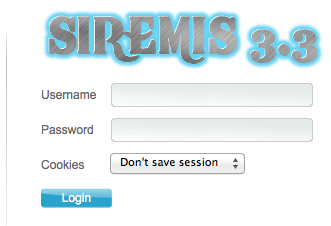

## Installation

L'installation de Siremis est simple et se fait principalement via un assistant Web. En quelques étapes et moins de 10 minutes, votre site Web Siremis est configuré et prêt à vous offrir une administration facile de votre serveur Kamailio SIP.

Vous devez d'abord installer une version compatible de <a href="https://kamailio.org/docs/tutorials/5.4.x/kamailio-install-guide-git/" >Kamailio SIP Server</a>

**Siremis v5.3.x (devel)**

Dernière version: ***v5.3.0***

### Prerequis

* Apache Web Server
    
      apt-get install apache2
      
      a2enmod rewrite
    
* PHP

Pour php7

      apt-get install php php-mysql php-gd php-curl php-xml libapache2-mod-php php-pear
      
      a2enmod php7.0  #Pour rendre disponible le modules php7 pour apache2
 
Pour le panneau de commande XMLRPC, le paquet XML_RPC pear est nécessaire pour PHP5 ou PHP7 : 

    wget http://pear.php.net/get/XML_RPC-1.5.5.tgz
    pear upgrade XML_RPC-1.5.5.tgz 
  
  
## Téléchargement de Siremis depuis le dépôt GIT

    cd /var/www
    git clone https://github.com/asipto/siremis siremis-5.3.x
    cd siremis-5.3.x
    git checkout -b 5.3 origin/5.3

## Configuration du serveur web Apache

Apache v2.4

Si vous voulez configurer un alias pour Apache 2.4.x, vous pouvez vous lancer : 

    make apache24-conf
    
et vous obtenez l'extrait de configuration imprimé dans le terminal. Comme suit :

    Alias /siremis "/var/www/siremis-5.3.x/siremis"
	<Directory "/var/www/siremis-5.3.x/siremis">
		Options Indexes FollowSymLinks MultiViews
		AllowOverride All
		Require all granted
		<FilesMatch "\.xml$">
			Require all denied
		</FilesMatch>
		<FilesMatch "\.inc$">
			Require all denied
		</FilesMatch>
	</Directory>
Vous pouvez copier&coller ce qui a été imprimé dans le terminal dans le fichier conf d'Apache, dans les paramètres de VirtualHost. 

Pour Apache2 sur Debian/Ubuntu, le fichier de configuration est : 

    /etc/apache2/sites-available/000-default.conf
    
Après le redémarrage du serveur web, SIREMIS sera disponible sous : 

 http//:votre_ip/siremis/. 
 
 Exemple: http://192.168.50.131/siremis/
 
 Si vous souhaitez utiliser un autre alias, modifiez le Makefile et changez la valeur d'URLBASE. 
 
 
 ## Préparer la configuration locale de Siremis
 
 L'étape suivante consiste à créer les fichiers de configuration **.htaccess** et **Siremis**, vous devez lancer la commande prepare. 
 
Apache v2.4

 	make prepare24
 
La sortie ressemble à : 

	siremis-x.y.z# make prepare24
	updating htaccess file...
	updating app.inc file...
	done
	
Assurez-vous que les répertoires suivants ont un accès en écriture pour l'utilisateur du serveur web : 

	
   * siremis/log
   * siremis/session
   * siremis/files
   * siremis/themes/default/template/cpl
   
Sur Debian/Ubuntu, vous pouvez le faire : 

	siremis-x.y.z# make chown
    
N'oubliez pas de redémarrer le serveur web après avoir effectué les modifications dans son fichier de configuration.

## Configuration de la base de données

Le serveur de base de données à utiliser est MySQL.

Vous devez créer un utilisateur MySQL qui a accès à la base de données Siremis, par exemple : 

	GRANT ALL PRIVILEGES ON siremis.* TO siremis@localhost IDENTIFIED BY 'siremisrw';

Vous pouvez exécuter une instruction SQL via l'outil de ligne de commande mysql, en vous connectant au serveur MySQL en tant qu'utilisateur root.

Cet utilisateur MySQL sera nécessaire plus tard au cours de l'installation, bien entendu, vous pouvez utiliser un utilisateur MySQL existant qui dispose de suffisamment de privilèges. 

## Assistant d'installation sur le Web

Une fois que vous avez effectué les étapes ci-dessus, accédez à la page web : 

 http//:votre_ip/siremis/. 

La première fois, vous êtes redirigé vers un assistant d'installation. Suivez les étapes. 

### Première Page

Vous obtenez une page pour commencer le processus d'installation. 

### Étape 1

La première étape indique le statut des éléments requis. Vous devez mettre à jour la configuration locale jusqu'à ce que tous les éléments soient vérifiés. 

### Étape 2

Dans la deuxième étape, vous devez introduire les détails pour accéder à la base de données Kamailio et Siremis.

Lorsque vous installez Siremis pour la première fois, vous devez probablement sélectionner les options suivantes (au bas du formulaire web) :

* **Créer la base de données Siremis** - cette option crée la base de données "Siremis".
* **Importer les données par défaut** - cette fonction permet d'importer les données initiales dans la base de données "siremis".
* **Mise à jour de la base de données SIP** - elle met à jour la structure de la base de données Kamailio pour les modules de comptabilité et de graphiques
* **Remplacer DB Config** - ceci met à jour le fichier de configuration de Siremis avec les détails pour accéder aux bases de données

**NOTE IMPORTANTE : sachez que la case à cocher se trouve à droite du texte décrivant l'option. À moins que vous ne fassiez une personnalisation, la première installation nécessite que toutes les cases soient cochées.** 

### Étape 3

Cette page présente un rapport d'état d'installation, indiquant si les répertoires requis ont un accès en écriture et un résumé des détails d'accès à la base de données. 

### Étape 4

C'est la fin de l'installation, présentant le nom d'utilisateur et le mot de passe pour se connecter à Siremis. Cette page est automatiquement redirigée vers la page de connexion après un court laps de temps. 

### Page de connexion

Après la première connexion, n'oubliez pas de mettre à jour le mot de passe pour l'utilisateur admin. 

